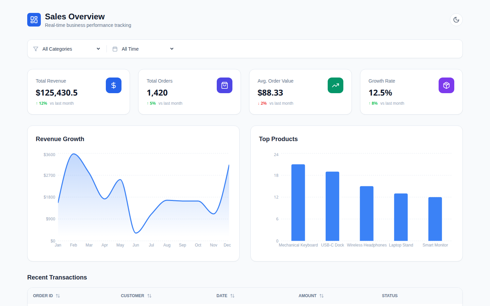
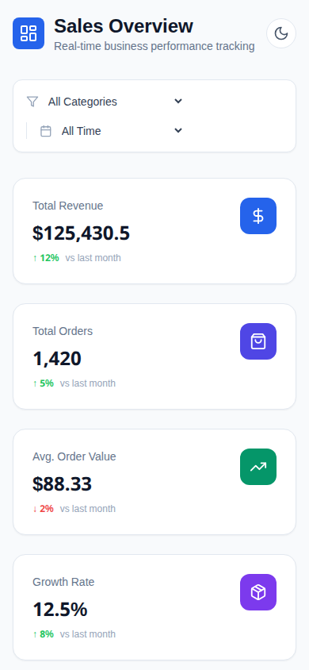

# Sales Analytics Dashboard

A responsive sales analytics dashboard built with React 18 and TypeScript. Visualizes revenue trends, product performance, and order data through interactive charts and filterable tables.

> **Live demo:** https://sales-dashboard-kappa-self.vercel.app

## Features

- **KPI Cards** — Total revenue, total orders, average order value, and growth rate at a glance
- **Revenue Chart** — Monthly revenue area chart aggregated from filtered order data
- **Products Chart** — Top 5 products by sales volume
- **Orders Table** — Sortable columns, pagination (10 per page), and status badges
- **Filtering** — Category filter and date range selector (7 / 30 / 90 days / all time)
- **Dark / Light Mode** — Toggle with `class`-based Tailwind dark mode
- **Fallback Data** — If the API is unreachable the dashboard loads demo data automatically
- **Responsive** — Single-column mobile layout, multi-column on tablet and desktop

## Tech Stack

| Layer | Technology | Version |
|---|---|---|
| UI | React | 18.2 |
| Language | TypeScript | 5.2 |
| Build tool | Vite | 5.1 |
| Styling | Tailwind CSS | 3.4 |
| Charts | Recharts | 2.12 |
| Icons | Lucide React | 0.344 |
| Serverless API | Vercel Node Runtime | 12.0 |
| Linting | ESLint | — |

## Architecture

```
sales-dashboard/
├── api/                          # Vercel serverless functions
│   ├── sales-data.ts             # GET /api/sales-data  → Order[]
│   └── sales-summary.ts          # GET /api/sales-summary → SalesSummary
├── src/
│   ├── components/
│   │   ├── DashboardHeader.tsx   # Title + dark mode toggle
│   │   ├── FilterBar.tsx         # Category & date range filters
│   │   ├── KpiCard.tsx           # Single KPI metric card
│   │   ├── OrdersTable.tsx       # Sortable, paginated table
│   │   ├── ProductsChart.tsx     # Top products bar chart
│   │   └── RevenueChart.tsx      # Monthly revenue area chart
│   ├── types/
│   │   └── index.ts              # Order, SalesSummary, ChartData interfaces
│   ├── App.tsx                   # Root — data fetching, state, layout
│   ├── main.tsx                  # Entry point
│   └── index.css                 # Tailwind directives
├── index.html
├── vite.config.ts
├── tailwind.config.js
├── tsconfig.json
├── postcss.config.js
└── vercel.json
```

### Data flow

1. `App.tsx` fetches `/api/sales-data` and `/api/sales-summary` in parallel on mount.
2. If either request fails, hardcoded fallback data is used and a warning banner is shown.
3. Client-side `useMemo` chains handle filtering → sorting → pagination → chart aggregation.
4. Charts receive only the currently-filtered subset, so all interactions stay in sync.

### Key types

```ts
interface Order {
  id: string;
  customer: string;
  date: string;
  amount: number;
  category: string;
  status: 'Completed' | 'Pending' | 'Cancelled';
  product: string;
}

interface SalesSummary {
  totalRevenue: number;
  totalOrders: number;
  avgOrderValue: number;
  growthRate: number;
}
```

## Responsive behavior

| Breakpoint | Layout |
|---|---|
| Mobile (<768 px) | Single column — KPIs stack vertically, charts full-width, table scrollable |
| Tablet (768–1024 px) | 2-column KPI grid, charts side-by-side |
| Desktop (>1024 px) | 4-column KPI grid, charts side-by-side, full table width |

## Accessibility

- Semantic HTML (`<main>`, `<h3>`, `<table>`) and proper heading hierarchy.
- Interactive elements are focusable and keyboard-navigable.
- Color contrast meets WCAG AA against both light and dark backgrounds.
- Sort indicators and pagination buttons include descriptive text.
- Loading spinner uses `Loader2` icon with an accessible text label.

## API / Data

### Endpoints

| Method | Path | Returns |
|---|---|---|
| GET | `/api/sales-data` | `Order[]` — 80 randomly generated orders |
| GET | `/api/sales-summary` | `SalesSummary` — static KPI values |

### Fallback behavior

When running locally without the serverless functions (or if they return an error), `App.tsx` catches the failure and loads embedded demo data. An amber banner alerts the user that demonstration data is being shown.

The serverless handlers generate mock data on every request — no database is required.

## Getting started

### Prerequisites

- Node.js >= 18
- npm

### Install & run

```bash
npm install
npm run dev
```

The app is served at `http://localhost:3000`.

## Scripts

| Command | Description |
|---|---|
| `npm run dev` | Start Vite dev server with HMR |
| `npm run build` | Type-check with `tsc`, then produce a production build in `dist/` |
| `npm run preview` | Serve the production build locally for testing |
| `npm run lint` | Run ESLint across `.ts` and `.tsx` files |

## Production build

```bash
npm run build
```

Output is written to `dist/`. Serve it with any static file server or deploy to a CDN.

## Deployment (Vercel)

Live production deployment: **https://sales-dashboard-kappa-self.vercel.app** (project name: `sales-dashboard`).

1. Push the repository to GitHub.
2. Import the repository in the Vercel dashboard.
3. Framework preset: **Vite**. Build command: `npm run build`. Output directory: `dist`.
4. Click **Deploy**.

Serverless functions in `api/` are automatically picked up and exposed at:

```
/api/sales-data
/api/sales-summary
```

No environment variables are required — all data is generated mock data.

## License

MIT

---

## Screenshots

> Screenshots are captured from the live deployment.

| View | Desktop | Mobile |
|------|---------|--------|
| Dashboard Overview |  |  |
| Charts & Analytics | — | — |
| Orders Table | — | — |
| Dark Mode | — | — |

---

## Author

**Nadeem** — Front-End Developer
